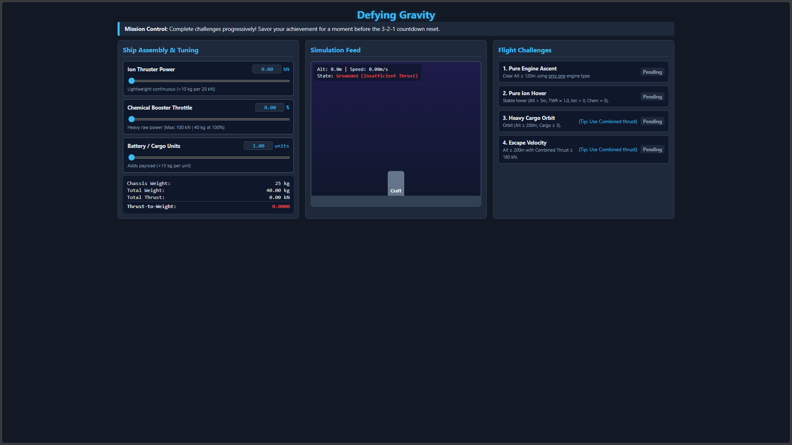

# Defying Gravity 🚀

  

An interactive browser-based physics simulation and progressive learning game designed to teach students concepts like **Thrust-to-Weight Ratio (TWR)**, payload mass scaling, and rocket propulsion.

## 🌟 Features
* **Progressive Flight Challenges:** Guides learners from basic atmospheric ascent to orbital physics and escape velocity.
* **Dynamic Physics Engine:** Real-time calculations factoring in chassis weight, ion thrusters, chemical boosters, and cargo payload.
* **Zero Dependencies:** Built entirely with vanilla HTML5, CSS3, and JavaScript—loads instantly in any modern browser without installation.

## 🎮 Play Live
Try the live version directly on GitHub Pages: 
*(Once you enable GitHub Pages, paste your link here, e.g., https://conceptexplorer.github.io/defying-gravity/)*

## 🏫 For Educators
Feel free to use this tool in science or computer science classrooms to demonstrate physics equations or front-end web development concepts. 

## 📄 License
Distributed under the **MIT License**. See the [LICENSE](LICENSE) file for more information.